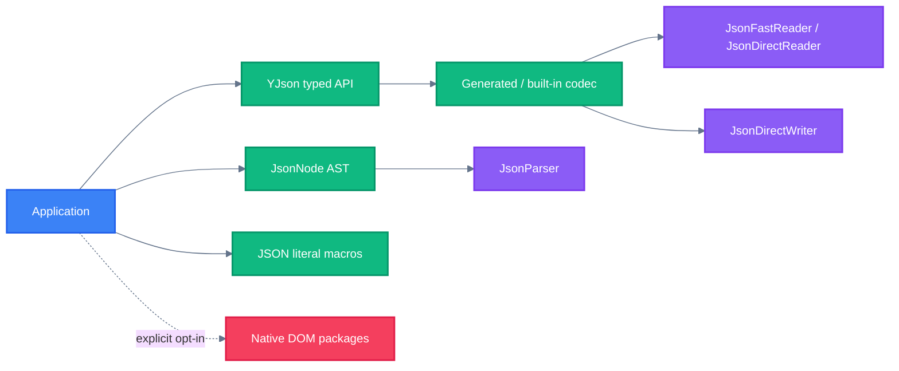

<!-- BEAUTIFIED -->

<h1 align="center">yjson</h1>

<p align="center">
  <strong>面向仓颉的 generated JSON library，提供类型安全编解码、JSON 字面量、可修改 AST 与流式 API。</strong>
  <br />
  <em>Pure Cangjie core · Build-time codecs · Optional native backends</em>
</p>

<p align="center">
  <a href="#快速开始"></a>
  <a href="LICENSE"></a>
</p>

<p align="center">
  
  
</p>

yjson 默认使用纯仓颉实现。Native DOM 是面向特定内存和遍历场景的显式可选后端，
不会被 core 或宏包隐式启用。

## 功能特性

| 能力 | 说明 |
|---|---|
| Generated typed codec | `@JsonCodec` 在调用方编译期生成编解码代码，不依赖运行时反射。 |
| JSON 字面量 | `@Json({...})` 直接生成 compact `String`；`@JsonValue({...})` 生成可修改 `JsonNode`。 |
| 完整数据入口 | 支持 `String`、`Array<Byte>`、stream、可修改 AST 和 compact document。 |
| 明确的输入策略 | 可配置未知字段、重复 key、数字保留、嵌套深度和字节预算。 |
| JSON Schema | 支持常用类型、组合、引用和边界校验。 |
| 可选 Native DOM | 提供 Custom Native Compact 与 vendored yyjson 后端，生命周期由调用方显式管理。 |

## 安装

要求仓颉 SDK 1.1.0，且 `cjc`、`cjpm` 位于 `PATH`。

普通应用推荐使用聚合包，它同时提供 runtime、`@JsonCodec`、`@Json` 和
`@JsonValue`：

```toml
[dependencies]
yjson_all = "2.0.0"
```

只需要 parser、AST 或内置 codec 时，可以仅依赖 core：

```toml
[dependencies]
yjson = "2.0.0"
```

所有 yjson package 必须使用同一版本。Native package 还要求 Python 3、C11 compiler
和 `ar`；当前 qualified 平台为 Linux x86_64。

## 快速开始

下面的示例生成 `User` 的 typed codec，并完成 JSON 往返：

```cangjie
package yjson_demo

import yjson_all.*

@JsonCodec
class User {
    public let id: Int64
    public let name: String

    public init(id: Int64, name: String) {
        this.id = id
        this.name = name
    }
}

main(): Unit {
    let text = YJson.toJson(User(7, "Alice"))
    let user = YJson.fromJson<User>(text)
    println(user.name)
}
```

仓库内的纯仓颉示例可以直接运行：

```bash
cd packages/examples
cjpm run
```

## 使用方法

### JSON 字面量

`@Json` 直接驱动 `JsonDirectWriter`，适合构造最终 JSON 文本。`$()` 可以插入运行时
值，且从左到右各求值一次。

```cangjie
let key = "user"
let id: Int64 = 7

let text = @Json({
    "ok": true,
    "items": [1, null, $(id)],
    $(key): $(User(id, "Alice")),
})
```

`@JsonValue` 返回可修改的 `JsonNode`：

```cangjie
let root = @JsonValue({"name": "Alice", "items": [1, 2]})
root["name"] = "Bob"
root["items"][0] = 9
println(YJson.stringify(root))
```

静态重复 key 是编译错误。对象包含动态 key 时，运行时冲突采用 LastWins。

### Parser 与 AST

```cangjie
let value = YJson.parse("{\"name\":\"Alice\",\"age\":30}")
let object = value.asObject()
object.put("active", JsonBoolValue(true))

println(object.get("name").getOrThrow().asString().value)
println(YJson.stringifyPretty(object))
```

### 重复 typed decode

高频重复使用同一个 generated codec 时，可以复用解析后的 fast decoder：

```cangjie
let decoder = YJson.fastDecoder(UserJson)
let fromString = decoder.decodeString(text)
let fromBytes = decoder.decodeBytes(unsafe { text.rawData() })
```

无配置重载使用 compact fast reader；显式传入 `JsonReadConfig` 时保留完整配置语义。

## API 选择

| 需求 | 推荐入口 | 返回值 |
|---|---|---|
| 类型安全编解码 | `YJson.toJson` / `YJson.fromJson<T>` | typed value / `String` |
| 直接构造 JSON 文本 | `@Json({...})` | `String` |
| 构造并修改 JSON 树 | `@JsonValue({...})` | `JsonNode` |
| 解析或输出 JSON 树 | `YJson.parse` / `YJson.stringify` | `JsonNode` / `String` |
| 低内存只读查询 | `YJson.parseCompact` | `CompactJsonDocument` |
| 自定义或内置 codec | `encode*With` / `decode*With` | typed value / JSON |
| Stream I/O | `encodeToStreamWith` / `decodeFromStreamWith` | caller-owned stream |

Stream API 不关闭调用方提供的 stream。当前 stream decode 会读取全部剩余输入，并非
恒定内存的增量 parser。

## 架构



宏在调用方编译期间生成 codec；runtime 负责 reader、writer、AST、Schema 和错误模型。
更完整的调用链与 package 边界见 [架构说明](docs/architecture.md)。

## Native backends

| Backend | 默认启用 | 生命周期 | 主要用途 |
|---|---|---|---|
| Pure Cangjie | 是 | GC 管理 | typed codec、可修改 AST、可移植默认实现 |
| Custom Native Compact | 否 | C-owned，必须 `close()` | 低内存只读查询与受控语义 fallback |
| yyjson Direct Native DOM | 否 | C-owned，必须 `close()` | bulk traversal、coarse query 与 serialization |

Native document 不是线程安全对象。`close()` 需要独占所有权，关闭后其 value view
不可再使用。详细语义、错误兼容性和 C ABI 见 [Backend contracts](docs/backends.md)。

## 输入、错误与资源限制

默认读取忽略未知字段，重复 key 使用 LastWins，并尽量将整数保留为精确 `Int64`。
`JsonReadConfig` 可以选择 Reject unknown fields、Reject duplicate keys 或
`PreserveLiteral`，也可以限制文档、字符串/key、根容器字节数和嵌套深度。

`JsonException` 提供 `code`、`byteOffset`、`line`、`column` 和 `path`。资源限制的
单位、默认值及 backend 一致性见 [不可信输入资源边界](docs/resource-limits.md)。

## JSON Schema

`JsonSchema.parse` 读取 Schema；`validate` 返回错误列表，`validateOrThrow` 抛出
`JsonValidationError`。当前实现覆盖 boolean schema、本地 `$ref`、`type`、`enum`、
`const`、数值和字符串边界、`required`、`properties`、`items`、`allOf`、`anyOf`、
`oneOf` 与 `not`，不是完整的 draft 2020-12 实现。

## 性能

性能结论来自固定 CPU、相同 SDK/构建参数和交替样本的 SSH Server 测量。当前与
`cjfast_json` 的同语义对比覆盖 37 项：yjson 的 paired median 在 29 项中更低，
其中 25 项为 11/11 同方向。README 采用两侧 CV 均不超过 5% 的展示门槛，共有
14 项达标。大 Map encode 的独立稳定复测为 yjson `119.887 us`、cjfast_json
`132.802 us`，yjson 领先 `10.82%`。

下表列出其中具备四库数据的 13 项。数值为“该库耗时 / 同批次 yjson 耗时”，因此
`1.00x` 是 yjson，数值越小越快；CV 列来自 yjson/cjfast_json 的 11 轮正式测量：

| Workload | yjson | stdx.json / yjson | fastjson2 / yjson | cjfast_json / yjson | CV Y/C |
|---|---:|---:|---:|---:|---:|
| 大 Map encode / string | 1.00x | 3.43x | 0.04x | 1.09x | 2.14% / 4.01% |
| 大数组 decode / string | 1.00x | 25.21x | 0.19x | 1.77x | 4.99% / 3.15% |
| 大数组 encode / string | 1.00x | 4.48x | 0.06x | 0.75x | 2.94% / 1.51% |
| `ProfileBundle` decode / bytes | 1.00x | 8.88x | 0.06x | 1.16x | 3.15% / 4.96% |
| `ProfileBundle` encode / bytes | 1.00x | 6.78x | 0.05x | 0.92x | 3.14% / 4.24% |
| `ProfileBundle` encode / string | 1.00x | 6.32x | 0.06x | 0.86x | 2.16% / 4.14% |
| `UInt64Envelope` decode / bytes | 1.00x | 7.92x | 0.07x | 1.04x | 3.03% / 4.48% |
| `UInt64Envelope` encode / bytes | 1.00x | 10.45x | 0.18x | 1.00x | 2.66% / 2.83% |
| `UInt64Envelope` encode / string | 1.00x | 9.79x | 0.22x | 1.03x | 2.54% / 3.71% |
| `TemporalStats` encode / bytes | 1.00x | 4.93x | 0.06x | 1.05x | 0.85% / 2.27% |
| `TemporalStats` encode / string | 1.00x | 4.82x | 0.16x | 1.04x | 1.09% / 1.49% |
| 深层嵌套 decode / string | 1.00x | 8.79x | 0.07x | 1.26x | 3.45% / 1.12% |
| 深层嵌套 encode / string | 1.00x | 3.33x | 0.04x | 0.78x | 2.03% / 2.72% |

这不是一次四库同时运行的总排名：stdx.json 与 Java fastjson2 来自 2026-08-20
snapshot；cjfast_json 来自 2026-08-21 的 11 轮正式测量。Java 与仓颉的运行时、GC
和计时器不同，fastjson2 列仅用于 workload 透视。第 14 项是 static-container
encode；它缺少 stdx.json 与 fastjson2 对照，因此没有放入四库表。

完整样本、p95、CV、MAD、环境限制、JSON literal 测量和被拒实验统一记录在
[性能方法与结果](docs/performance.md)。复现入口见 [benchmark 指南](benchmarks/README.md)。

## 构建与验证

```bash
cjpm test
(cd packages/yjson_native && cjpm test)
(cd packages/yjson_yyjson && cjpm test)
YJSON_FUZZ_CASES=5000 scripts/release_native_checks.sh
```

Native 构建脚本尊重 `CC` 与 `AR`。Linux x86_64 是当前唯一 qualified 平台；
AArch64 尚未 qualification，musl 尚未验证。

## 项目结构

```text
src/                      # Pure Cangjie runtime、AST、codec、Schema 与测试
packages/yjson_macros/    # @JsonCodec、@Json、@JsonValue
packages/yjson_all/       # runtime + macros 聚合包
packages/yjson_native/    # Custom Native Compact backend
packages/yjson_yyjson/    # vendored yyjson backend
packages/examples/        # 可执行示例
benchmarks/               # 跨库 benchmark adapters
docs/                     # 架构、性能、backend 与发布文档
scripts/                  # 构建、验证、benchmark 与发布工具
```

## 文档

- [架构与调用链](docs/architecture.md)
- [Backend contracts](docs/backends.md)
- [性能方法与原始限制](docs/performance.md)
- [Public API inventory](docs/public-api-inventory.md)
- [资源限制](docs/resource-limits.md)
- [Release checklist](docs/release-checklist.md)
- [第三方组件与许可](THIRD_PARTY_NOTICES.md)

## 贡献

提交修改前请运行与变更范围对应的 core、consumer 或 Native 验证，并在 Pull Request
中说明行为变化、兼容性影响和测试证据。性能变更还应附带同环境 baseline/candidate
原始样本。

## 许可证

[Apache License 2.0](LICENSE)
