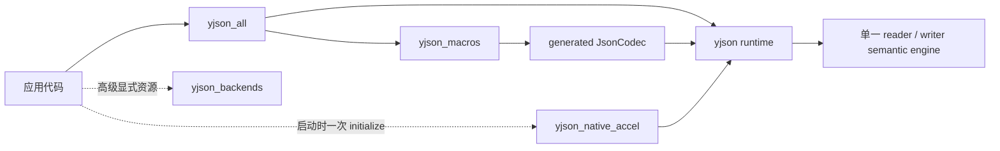

<!-- BEAUTIFIED -->

<h1 align="center">yjson</h1>

<p align="center">
  <strong>面向仓颉的类型安全 JSON 库</strong>
  <br />
  <em>编译期 Codec · JSON 字面量 · Mutable AST · Compact DOM · Stream I/O</em>
</p>

<p align="center">
  <a href="https://github.com/lIlIIlIll/yjson/actions/workflows/ci.yml"></a>
  <a href="https://codecov.io/gh/lIlIIlIll/yjson"></a>
  <a href="https://github.com/lIlIIlIll/yjson/releases/latest"></a>
  <a href="docs/performance/results/2026-08-27-yjson-2.0.0.md"></a>
</p>

<p align="center">
  
  <a href="release/2.0.0/evidence.md"></a>
  <a href="docs/architecture.md"></a>
  <a href="LICENSE"></a>
</p>

yjson 2.0 默认使用跨平台、GC 管理的 Pure 引擎。普通应用只需要
`YJson.toJson`、`YJson.fromJson<T>` 与 `YJson.parseDocument`；不需要选择 backend，
也不需要管理 scanner、whole-document 资源或 `close()`。

## 适合什么场景

- class、struct、enum 与 JSON 之间的类型安全转换；
- 需要编译期生成代码、但不希望依赖运行时反射的应用；
- 同时需要 typed codec、可修改 `JsonNode`、只读 Compact DOM 或 Stream I/O 的项目；
- 需要明确控制未知字段、重复 key、数字策略、嵌套深度和 byte budget 的服务端程序；
- 需要 JSON Schema draft 2020-12、JSON Pointer、Patch、Merge Patch 或 JSONPath 的工具。

如果只需要 SDK 自带的基础 JSON 能力，或不需要 generated typed mapping，先阅读
[库能力对比](docs/library-comparison.md)，再决定是否引入 yjson。

## 安装

要求仓颉 SDK 1.1.0，且 `cjc`、`cjpm` 位于 `PATH`。当前仓库示例使用 path
dependency，不假定任何 registry 包已经发布。

普通应用推荐依赖聚合包：

```toml
[dependencies]
yjson_all = { path = "../yjson/packages/yjson_all" }
```

`yjson_all` 同时导出 runtime 与 `@JsonCodec`、`@Json`、`@JsonValue`。它不会隐式启用
Native backend。只使用 parser、AST 或内置 codec 时，可以仅依赖 core：

```toml
[dependencies]
yjson = { path = "../yjson" }
```

`yjson` 与 `yjson_macros` 作为一个发行单元升级；generated codec 通过 v1 protocol
检查兼容性，不要求应用人工匹配 exact commit。Native 加速与高级 backend 的依赖和
构建要求见 [Backend 使用指南](docs/backends.md)。

## 快速开始

```cangjie
package yjson_demo

import yjson_all.*

@JsonCodec
class User {
    public let id: Int64
    public let name: String

    public init(id: Int64, name: String) {
        this.id = id
        this.name = name
    }
}

main(): Unit {
    let text = YJson.toJson(User(7, "Alice"))
    let user = YJson.fromJson<User>(text)
    println(user.name)
}
```

`@JsonCodec` 在调用方编译时生成 `UserJson: JsonCodec<User>` 和
`JsonCodecProvider` 实现。它不扫描源码目录，也不依赖运行时反射。可运行的完整示例位于
[`packages/examples`](packages/examples/README.md)。

## 性能

2.0.0 的发布门禁在固定的 Linux x86_64 Server CPU 8、128 MiB 环境中执行，每个
workload 交替测量 11 轮。下表只展示发布门槛 workload；数值是中位数，比例越低越快。

| Workload | yjson / Native | 对照 | 比例 | 胜出轮次 |
| --- | ---: | ---: | ---: | ---: |
| Large Array encode / string | 46.080 µs | cjfast_json 76.117 µs | 0.608x | 11/11 |
| ProfileBundle encode / bytes | 10.344 µs | cjfast_json 12.546 µs | 0.816x | 11/11 |
| ProfileBundle encode / string | 10.767 µs | cjfast_json 12.338 µs | 0.845x | 11/11 |
| Deep Nested encode / string | 63.552 µs | cjfast_json 74.500 µs | 0.856x | 11/11 |
| Native writeNumericBytes | 0.559 ms | Pure 2.354 ms | 0.238x | 11/11 |
| Native readNumericDocument | 1.211 ms | Pure 2.148 ms | 0.564x | 11/11 |

这些结果只适用于对应源码、SDK、主机、workload 和测量方法。完整 36-workload 结果、
CV、原始样本、checksum 与复现边界见
[2.0.0 性能报告](docs/performance/results/2026-08-27-yjson-2.0.0.md)。

## 按任务选择 API

| 你要做什么 | 使用什么 | 结果或约束 |
| --- | --- | --- |
| typed value 与 JSON 互转 | `YJson.toJson` / `YJson.fromJson<T>` | 类型安全；类型需提供 codec |
| 使用显式或自定义 codec | `encode*With` / `decode*With` | 不要求类型实现 provider |
| 直接构造 JSON 文本 | `@Json({...})` | 返回 `String`；不先创建 AST |
| 构造并修改 JSON 树 | `@JsonValue({...})` / `YJson.parse` | 返回 `JsonNode` |
| 只读查询文档 | `YJson.parseDocument` | GC 管理的 Compact document，无 `close()` |
| 读写 caller-owned stream | `toStream` / `fromStream` 或 `*StreamWith` | 不关闭调用方 stream |
| 校验 JSON | `yjson_algorithms.JsonSchema` | draft 2020-12；默认有限预算 |
| 定位、查询或更新节点 | `yjson_algorithms` 的 Pointer / Path / Patch | 默认有限预算 |

不知道从哪里开始时，阅读 [API 选择指南](docs/choosing-an-api.md)。

## 两种 JSON 字面量

`@Json` 直接生成紧凑 JSON 文本；`@JsonValue` 构造可修改树。`$()` 插值表达式从左到右
各求值一次。

```cangjie
let id: Int64 = 7
let text = @Json({"ok": true, "user": $(User(id, "Alice"))})

let node = @JsonValue({"name": "Alice", "items": [1, 2]})
node["name"] = "Bob"
println(YJson.stringify(node))
```

静态重复 key 是编译错误；动态 key 冲突采用 LastWins。完整语法和求值规则见
[JSON 字面量](docs/json-literals.md)。

## 组件关系



普通 typed 调用从 generated 或 built-in `JsonCodec<T>` 进入同一 reader/writer。
`YJsonNativeAccel.initialize()` 只在首次 `YJson` 调用前冻结一次 Native profile；之后仍使用
相同 `YJson` API，初始化失败不会静默回退。更完整的调用链见
[架构说明](docs/architecture.md)。

## 重要边界

- `JsonReadConfig` 组合 `JsonReadLimits`，`JsonWriteConfig` 组合 `JsonWriteLimits`；
  byte limit 的 `0` 表示 unlimited，默认深度为 256。
- 默认 stream API 真正增量读取单个完整 JSON document；它不是多文档 framing
  protocol。decode 失败后，不保证 stream 停在可恢复边界。
- 默认 `JsonDocument` 由 GC 管理。只有 `yjson_backends.BackendJsonDocument` 是显式资源。
- JSONPath、Patch/Merge Patch 与 Schema 位于 `yjson_algorithms`，默认预算耗尽统一抛出
  `JsonWorkLimitException(code: "work_limit_exceeded")`；可信离线任务可显式使用 `.unlimited`。
- 当前 release qualification 以 Linux x86_64 为阻断平台；其他平台不得从源码可移植性
  推断为已验证支持。
- 性能结果只适用于对应源码、SDK、主机、workload 和测量方法，不代表普遍排名。

配置、安全边界和错误码分别见[配置与错误](docs/configuration-and-errors.md)与
[资源限制](docs/resource-limits.md)。

## 文档

- [从安装到进阶的文档导航](docs/README.md)
- [API 选择指南](docs/choosing-an-api.md)
- [`@JsonCodec` 生成规则](docs/codec-generation.md)
- [AST 与 Compact DOM](docs/ast-and-compact.md)
- [Stream I/O](docs/streams.md)
- [Backend 使用指南](docs/backends.md)
- [JSON Schema](docs/schema.md)
- [性能方法与结果](docs/performance/README.md)
- [1.x → 2.0 迁移](docs/migration/1.x-to-2.0.md)
- [Release notes](RELEASE_NOTES.md) · [Changelog](CHANGELOG.md)

维护者请从[测试策略](docs/maintainers/testing.md)、
[发布流程](docs/maintainers/releasing.md)和[仓库布局](docs/maintainers/repository-layout.md)
开始。单次 RC 验收结果保存在 `release/`，不作为通用使用文档。

## 参与项目

提交代码前请阅读 [CONTRIBUTING.md](CONTRIBUTING.md)。安全问题的报告边界与当前渠道见
[SECURITY.md](SECURITY.md)；不要在公开 issue 中提交未修复漏洞的利用细节。

## 许可证

[Apache License 2.0](LICENSE)。可选 yyjson backend 的第三方许可见
[THIRD_PARTY_NOTICES.md](THIRD_PARTY_NOTICES.md)。
